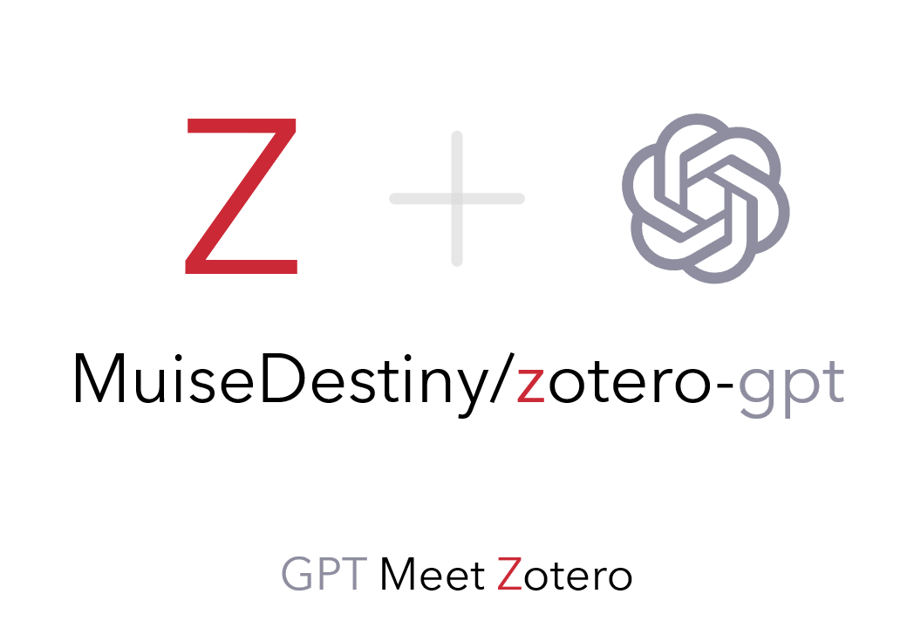

<div align="center">
  

# Sonder

**Context-aware academic chat for Zotero**

</div>

---

## Status

This repository is the migrated successor of the previous `zotero-gpt` working branch.

Current baseline goals already carried over:

- the plugin can be built as a Zotero add-on
- the plugin can be discovered and shown by Zotero
- the current OAuth/Codex login pipeline is preserved
- the current Codex backend chat pipeline is preserved

The next product phase is a larger rewrite toward the context-chat UX described in:

- [`docs/context-chat-spec-v0.1.md`](docs/context-chat-spec-v0.1.md)

## What this repo is for right now

This repo is **not** yet the final context-chat implementation.
It is the new, cleaner project home that preserves the currently working technical base:

- working add-on packaging / bootstrap behavior
- working Zotero loadability
- working ChatGPT/Codex OAuth flow
- working Codex request path and provider plumbing

That working base will be used for the next implementation stage.

## Key docs

- [`docs/migration-plan.md`](docs/migration-plan.md)
- [`docs/context-chat-spec-v0.1.md`](docs/context-chat-spec-v0.1.md)
- [`docs/context-chat-architecture.md`](docs/context-chat-architecture.md)
- [`docs/codex-oauth.md`](docs/codex-oauth.md)
- [`docs/plugin-loading-fix.md`](docs/plugin-loading-fix.md)

## Build

```bash
git clone <your-sonder-repo-url>
cd Sonder
npm install
npm run build-dev
```

Build output:

- unpacked add-on: `builds/addon/`
- XPI: `builds/sonder.xpi`

## Install in Zotero

Open Zotero:

- `Tools -> Add-ons`
- gear icon -> `Install Add-on From File...`
- select `builds/sonder.xpi`

## Current provider commands

The current migrated baseline still includes the legacy command-driven interface while the new UX is being designed.
Useful commands in the current baseline include:

```text
/provider openai-codex
/login
/report
```

## Experimental paper chat panel

The rewrite now includes an experimental paper-chat panel alongside the preserved legacy popup UI.

Current behavior:

- a visible `Chat` launcher button is mounted in the Zotero main window
- clicking it with an active PDF reader tab opens a large right-side panel
- the panel resolves explicit `Paper` context from the current PDF
- selecting an annotation/note item in the library and clicking `Chat` opens `Item + Paper` context
- in `Item + Paper` mode, selected item content is force-injected as primary anchor context
- the latest saved session is restored automatically per context (`paper` or `item+paper`)
- `New Session` creates another persisted session for the same context
- `History` lists saved sessions for the current context
- `Clear Session` clears messages in the active session with confirmation
- drag the panel’s left edge to resize width (width is remembered)
- the composer is wired to the current provider transport
- `Send` and `Enter` submit a message
- `Shift+Enter` inserts a newline
- multi-turn user/assistant messages are persisted per session
- the panel prepares chunked paper context from the active PDF and retrieves relevant chunks per question
- responses are now grounded with retrieved paper context in the panel transport path
- assistant messages show lightweight citation chips for retrieved paper chunks
- in `Item + Paper` mode, assistant citations include a `Selected annotation/note` chip to preserve item identity
- clicking a citation chip jumps back to the relevant PDF page, or selects the cited item for item-source chips
- assistant output is shown as raw markdown by default
- streaming stays in raw markdown form for stability
- a header toggle switches between `Raw Markdown` and rendered `Preview`
- preview mode renders headings, lists, tables, code blocks, and math expressions after streaming completes
- preview-mode math now supports `$...$`, `$$...$$`, `\(...\)`, and `\[...\]`
- raw markdown mode stays easy to copy into tools like Notion

Current limitation:

- citation jumping currently targets the relevant PDF page, not a fine-grained paragraph/box location yet
- math preview quality depends on the model emitting explicit math delimiters consistently, though the panel now nudges it toward `$...$` / `$$...$$`
- retrieval is currently a simple chunked lexical-ranking implementation, not the final retrieval stack yet
- item+paper mode always injects selected item text; paper retrieval still depends on available PDF preparation context
- the legacy shortcut/command UI remains available as a fallback while the rewrite continues

## Tests

```bash
npm test
npm run tsc
npm run build-dev
```

## Immediate migration acceptance criteria

The migrated baseline is considered acceptable if it still satisfies these already-working capabilities:

- Sonder appears in Zotero Add-ons
- the plugin starts successfully in Zotero
- Codex OAuth login can still be completed
- Codex chat can still return a response

Those are the minimum guarantees before the context-chat rewrite begins.
